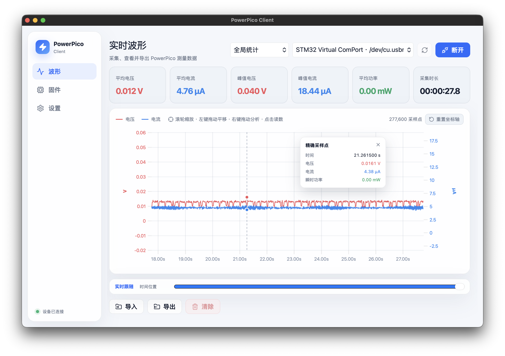
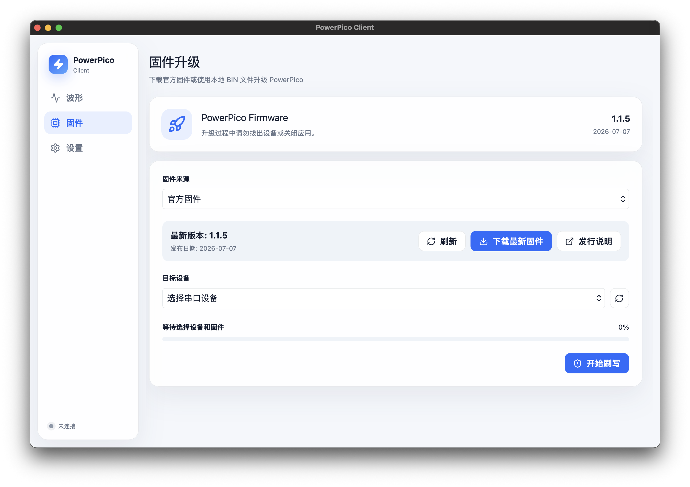
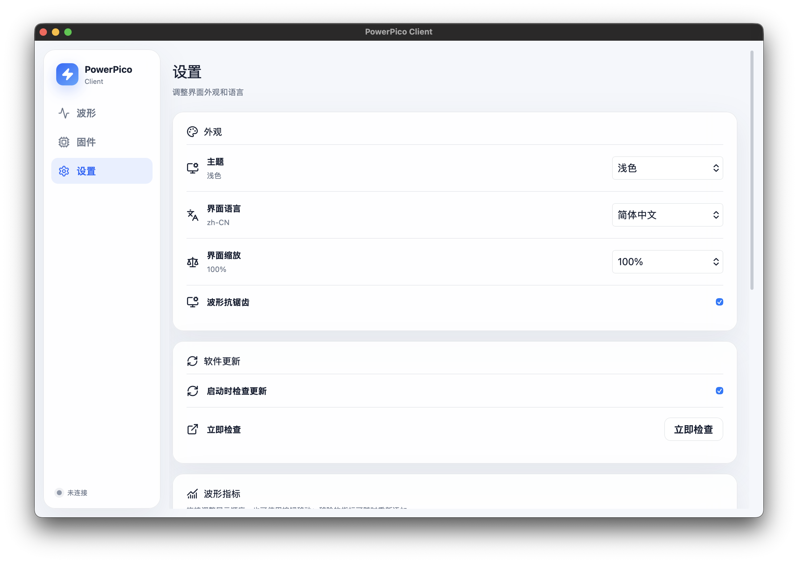

<div align="center">
  <h1 align="center">PowerPico Client</h1>
  <p align="center">面向 PowerPico 的跨平台数据采集、波形分析与固件升级客户端</p>

  <a href="https://github.com/No-Chicken/PowerPicoClient_rs/releases/latest"></a>
  <a href="./LICENSE"></a>
  
  
  
  
  <br>
  <a href="https://github.com/No-Chicken/PowerPicoClient_rs/stargazers"></a>
</div>

---

## 📖 项目简介

**PowerPico Client** 是使用 Tauri 2、Svelte 5 与 Rust 实现的 PowerPico 桌面客户端，提供高速数据采集、实时波形、精确区间分析、记录导入导出、固件升级、缓存管理和客户端更新能力。

<p align="center">
  <a href="https://github.com/No-Chicken/Power-Pico">Power-Pico 主项目</a> |
  <a href="https://github.com/No-Chicken/PowerPicoClient_rs/releases/latest">下载最新版</a> |
  <a href="https://no-chicken.com/content/Power-Pico/UserManual/client_operation.html">客户端操作说明</a> |
  <a href="https://github.com/No-Chicken/PowerPicoClient_rs/issues">问题反馈</a>
</p>

<p align="center">
  
</p>

### ✨ 核心特性

- **高速采集**：Rust 实现 1.5 Mbps 数据接收、PowerPico 协议解析、异常采样过滤和稳定设备标识。
- **实时波形**：支持实时跟随、历史浏览、时间/电压/电流独立缩放和平移，以及原始采样点精确读取。
- **多级数据**：兼容原客户端 L0/L1-L5 分级记录和 LOD 波形读取，支持 BIN/CSV 导入导出。
- **统计分析**：提供全局、最近 10 分钟、最近 1 分钟、最近 1 秒统计，以及右键拖选精确区间分析。
- **固件升级**：支持官方固件查询与缓存、自定义 BIN、Bootloader 重新枚举、YMODEM 刷写、进度显示和取消。
- **跨平台体验**：支持简体中文、繁体中文、英语、日语、系统语言模式，以及主题、界面缩放和渲染质量设置。
- **更新与维护**：支持客户端 OTA、缓存空间统计与清理、内部临时记录自动回收和平台滚动日志。

---

## 🖼️ 功能展示

<p align="center">
  
  
</p>

<p align="center"><sub>官方/自定义固件升级与多语言、界面缩放、波形渲染等设置</sub></p>

---

## 🚀 下载与安装

请从 [GitHub Releases](https://github.com/No-Chicken/PowerPicoClient_rs/releases/latest) 下载对应平台的安装包，并使用同一 Release 中的 `SHA256SUMS` 校验文件完整性。

### macOS Apple Silicon

1. 下载 `PowerPico-Client_<版本>_macos_aarch64.dmg`。
2. 打开 DMG，将 `PowerPico Client.app` 拖入“应用程序”。
3. 安装完成后在 Finder 侧边栏推出 `PowerPico Client` 磁盘映像卷。
4. 首次运行时，在 Finder 中按住 Control 点击应用并选择“打开”。

macOS 安装包目前未签名且未公证。如果系统仍然阻止运行，可在确认安装包来自本仓库后执行：

```zsh
xattr -dr com.apple.quarantine "/Applications/PowerPico Client.app"
open "/Applications/PowerPico Client.app"
```

设置页提供缓存空间统计、一键清理和完整卸载。完整卸载会将 App 移入废纸篓、删除应用数据，并推出仍挂载且经过应用标识校验的 PowerPico Client DMG 卷；下载目录中的原始 DMG 文件不会被删除。

客户端支持应用内检查、下载、签名校验和安装更新。OTA 更新包不会挂载新的 DMG 卷。

### Ubuntu / Debian Linux

DEB 安装包：

```bash
sudo apt install ./PowerPico-Client_<版本>_amd64.deb
```

AppImage：

```bash
chmod +x PowerPico-Client_<版本>_amd64.AppImage
./PowerPico-Client_<版本>_amd64.AppImage
```

---

## 💻 平台支持

状态说明：✅ 已实现并纳入发布测试　🚧 计划支持、尚未完成　⚠️ 已实现但存在平台限制　➖ 当前不计划支持或不适用

| 功能 | macOS 11+ / Apple Silicon | Ubuntu / Debian / x86_64 | Windows / x86_64 |
| :--- | :---: | :---: | :---: |
| 数据采集与波形 | ✅ | ✅ | 🚧 |
| 记录导入导出 | ✅ | ✅ | 🚧 |
| 设备固件升级 | ✅ | ✅ | 🚧 |
| 缓存管理 | ✅ | ✅ | 🚧 |
| 应用内卸载 | ✅ | ➖ | 🚧 |
| 客户端 OTA | ✅ | 🚧 | 🚧 |
| 发布包 | ⚠️ DMG（未签名/未公证）、✅ OTA 包 | ✅ DEB、AppImage | 🚧 MSI/NSIS |

macOS DMG 当前未进行 Apple Developer ID 签名和公证，因此首次启动可能需要通过 Finder 手动确认。DEB 包基于 Ubuntu 22.04 构建，理论上可用于 Debian 11+、Ubuntu 22.04+、Linux Mint 21+；AppImage 可在多数 x86_64 Linux 发行版运行。RPM 当前不在发布计划内。

### Linux 串口权限

客户端不应以 root 运行。Ubuntu/Debian 用户加入 `dialout`，Arch Linux 用户加入 `uucp`，然后注销并重新登录：

```bash
sudo usermod -aG dialout "$USER"  # Ubuntu / Debian
sudo usermod -aG uucp "$USER"     # Arch Linux
```

真机验收项目见 [Linux 测试清单](./docs/linux-testing.md)。

---

## 🛠️ 开发与构建

需要 Rust 1.77.2+、Node.js 20+ 和 pnpm 10+。

```bash
pnpm install
pnpm tauri dev
```

Arch Linux 开发依赖：

```bash
sudo pacman -S --needed base-devel webkit2gtk-4.1 libappindicator-gtk3 librsvg systemd
```

### 质量检查

```bash
pnpm check
pnpm test
pnpm build

cd src-tauri
cargo fmt --check
cargo clippy -- -D warnings
cargo test
```

### 构建安装包

macOS ARM64 未签名 DMG：

```bash
pnpm tauri build --bundles app,dmg
```

本地 Linux 构建使用固定的 Ubuntu 22.04 Docker 容器：

```bash
pnpm tauri:build:linux
```

Linux 产物输出到 `artifacts/linux/`。GitHub Actions 不使用该容器，而是在 `ubuntu-22.04` runner 上原生构建 DEB 和 AppImage。

---

## 📦 发布

Release workflow 支持两种入口：

- 推送严格格式的 `vX.Y.Z` tag 后自动执行。
- 在 GitHub Actions 页面手动运行 Release workflow，并输入一个已有的 `vX.Y.Z` tag。

发布前必须将中文说明保存到 `.github/release-notes/vX.Y.Z.md`。工作流会校验 tag 与 npm、Tauri、Cargo 版本一致，执行前后端质量检查，构建 macOS ARM64 DMG 和签名 OTA 包、Linux x86_64 DEB/AppImage，生成 `latest.json` 与 `SHA256SUMS` 并发布正式 Release。重新运行已发布 tag 时会覆盖同名资产和说明。

### OTA 签名密钥

Tauri updater 私钥不得提交到仓库。将本地 `.tauri-signing-private.key` 的完整内容配置为 GitHub Actions Secret `TAURI_SIGNING_PRIVATE_KEY`；如私钥带密码，同时配置 `TAURI_SIGNING_PRIVATE_KEY_PASSWORD`。公钥已写入 `src-tauri/tauri.conf.json`，丢失或更换私钥后，旧版本客户端将无法验证使用新密钥签名的更新，因此密钥轮换必须先发布同时信任新公钥的过渡版本。完整操作、验证和故障排查见 [macOS OTA 签名密钥配置](./docs/ota-signing.md)。

---

## 📂 数据与网络

设置和官方固件保存在系统应用数据目录，临时采集记录保存在应用缓存目录，日志保存在平台日志目录。官方固件信息来自 PowerPico 固件服务，客户端更新信息来自本仓库 GitHub Releases。

---

## 📄 许可证

Copyright (C) 2026 OpenFeastTech。

PowerPico Client 基于 [GNU General Public License v3.0 only](./LICENSE) 发布，SPDX 标识为 `GPL-3.0-only`。第三方组件声明见 [THIRD_PARTY_NOTICES.md](./THIRD_PARTY_NOTICES.md)。仓库中的旧 Python/Qt 客户端仅作为协议和行为兼容性参考，不参与本程序链接或打包。

欢迎通过 [Issues](https://github.com/No-Chicken/PowerPicoClient_rs/issues) 和 Pull Request 参与改进。
